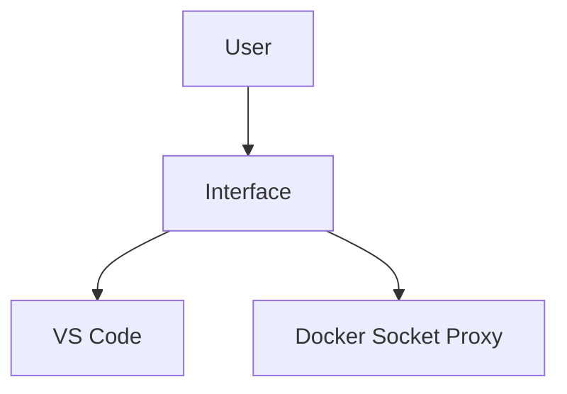

# Create a New Labspace

You are helping the user create a new, engaging, production-ready labspace. A labspace is an
interactive educational Docker environment that pairs markdown instructions (left panel) with a live
VS Code IDE (right panel). Users follow the instructions and execute commands directly from the
browser, all within an isolated Docker container environment.

The user has already cloned the labspace-starter template, which provides the basic repo scaffold
(`labspace/`, `project/`, a GitHub Actions workflow). Your job is to author all the content.

**Important: the `project/` directory IS the workspace root.** Files placed in `project/` in the
content repo are mounted at `/home/coder/project/` in the workspace, which is the terminal's default
working directory. Instructions must never tell users to `cd project` or reference paths prefixed
with `project/` — they are already inside it.

## User's Request

$ARGUMENTS

## Step 1: Gather Requirements

If the above does not clearly specify what the labspace should teach, ask:
**"What would you like this labspace to teach?"**

Then gather these remaining details (you may ask them all together):

1. **Audience**: Who is the target audience, and what prior knowledge should they have?
2. **Workspace type**: What technology stack does the lab use?
   - `base` — Docker tooling only (no language runtime)
   - `node` — Node.js/npm
   - `java` — Java/Maven
   - `python` — Python/Poetry/pytest
   - `sdlc` — Full CI/CD pipeline (Gitea + k3s + Traefik) — for end-to-end DevOps labs
3. **GitHub repo URL**: e.g., `https://github.com/username/labspace-my-topic`
4. **Labspace ID**: A kebab-case slug for the OCI artifact name (e.g., `docker-networking`). If not
   provided, derive one from the topic.

Once you have this information, proceed without asking further questions. Make reasonable decisions
for everything else.

## Step 2: Read Existing Files

Before generating anything, read the existing scaffold files:

- `labspace/labspace.yaml`
- All `.md` files in `labspace/`

You will be replacing these with your generated content.

## Step 3: Plan the Sections

Design 3–6 sections that build on each other progressively. Each section should:

- Have a single, clear learning objective
- Include at least one hands-on exercise (running a command, saving a file, etc.)
- End with the learner having accomplished something concrete

Typical section arc:

1. **Introduction** — set the scene, verify the environment works with a simple command
2. **Core concept #1** — explain and hands-on exercise
3. **Core concept #2** — explain and hands-on exercise
4. **Real-world scenario** — putting the concepts together in a realistic context
5. **(Optional) Challenge or wrap-up** — reinforce learning, next steps

## Step 4: Generate All Files

Generate every file below, creating or overwriting as needed. Do not modify the
`.github/workflows/` directory unless the workspace type is `sdlc` (see SDLC section below).

**Files to generate:**

- `labspace/labspace.yaml`
- `labspace/01-<section-name>.md`, `labspace/02-<section-name>.md`, etc. (one per section)
- `compose.override.yaml`
- Any files needed under `project/` (scripts, Dockerfiles, config files, sample apps, etc.)

> **Workspace directory mapping:** `project/Dockerfile` in the repo → `/home/coder/project/Dockerfile`
> in the workspace. The terminal opens at `/home/coder/project/` by default. Instructions should
> reference files as `Dockerfile`, `src/app.js`, etc. — never as `project/Dockerfile` or
> `~/project/Dockerfile`. Never instruct users to `cd project`.

---

## Reference: labspace.yaml

```yaml
metadata:
  id: my-labspace-id            # kebab-case, used as OCI artifact name
  sourceRepo: github.com/username/repo   # WITHOUT https://
  contentVersion: 1.0.0         # semver

title: My Labspace Title
description: One sentence describing what the learner will accomplish.

sections:
  - title: Section Title
    contentPath: 01-section-name.md   # relative to labspace/ directory, no ./

# Optional: defines extra service tabs in the right panel
services:
  - id: my-app
    title: My App
    url: http://localhost:3000
    icon: web             # Google Material Icons name (e.g. web, terminal, cloud, storage)
```

The `contentPath` value must exactly match the actual filename in the `labspace/` directory.

---

## Reference: compose.override.yaml

### Standard labspace

```yaml
services:
  configurator:
    environment:
      PROJECT_CLONE_URL: https://github.com/username/repo

  workspace:
    image: dockersamples/labspace-workspace-node   # choose appropriate preset
```

**Workspace image options:**

| Image | Included tooling |
|-------|-----------------|
| `dockersamples/labspace-workspace-base` | Docker CLI, Compose, BuildKit |
| `dockersamples/labspace-workspace-node` | Node.js, npm (+ base) |
| `dockersamples/labspace-workspace-java` | Java JDK, Maven (+ base) |
| `dockersamples/labspace-workspace-python` | Python, Poetry, pip, pytest (+ base) |

**Only add `ports` if the lab runs an app _inside the workspace container itself_** (e.g.,
`npm run dev` or a Spring Boot app). Apps running in user-created containers publish their own
ports and do not need to be listed here.

```yaml
  workspace:
    ports: !override
      - "3000:3000"
      - "8085:8085"
```

> **Do not modify any services other than `configurator` and `workspace`.** Changes to other
> services (interface, socket-proxy, etc.) can break the labspace environment.

### SDLC variant (Gitea + k3s + Traefik)

For CI/CD or Kubernetes labs, use the SDLC variant. In order to use it, the following changes need
to occur:

- The `compose.yaml` needs to be updated to use the `oci://dockersamples/labspace-content-dev:latest-sdlc` base.

- The SDLC infrastructure is enabled by updating the GitHub Actions publish workflow (`.github/workflows/publish.yml`) to set:

    ```yaml
    - name: Publish Labspace
      uses: dockersamples/publish-labspace-action@v2
      with:
        labspace_base_version: latest-sdlc   # <-- add this line
        target_repo: ${{ env.DOCKERHUB_REPO }}
    ```

The `compose.override.yaml` is the same as a standard labspace — just change the workspace image 
if needed. 

**SDLC pre-configured services:**

| Service | URL | Credentials |
|---------|-----|-------------|
| Gitea (Git + Registry) | `http://git.dockerlabs.xyz` | `moby` / `moby1234` |
| Container registry | `http://registry.dockerlabs.xyz` | No auth required |
| k3s Kubernetes | via `kubectl` / `k` alias | kubeconfig pre-configured |
| Deployed apps | `http://app.dockerlabs.xyz` | routed via Traefik |
| Traefik dashboard | `http://localhost:8080` | — |

**CI/CD secrets automatically available in `moby/demo-app` (unless `SKIP_CI_SECRET_SETUP` is set to 
`true` on the `workspace` service):**

| Secret | Value |
|--------|-------|
| `DOCKER_REGISTRY` | `registry.dockerlabs.xyz` |
| `DOCKER_USERNAME` | `moby` |
| `DOCKER_PASSWORD` | `moby1234` |
| `DOCKERHUB_USERNAME` | from user's Docker Desktop |
| `DOCKERHUB_PASSWORD` | from user's Docker Desktop |
| `KUBECONFIG` | pre-generated k3s config |

**Note:** If the `SKIP_CI_SECRET_SETUP` environment variable is set on the `workspace` service, all
CI secret setup will be skipped. Ideally, this is set in the lab's own `compose.override.yaml` file.
This is helpful in labs in which the student is going to setup the CI secrets themselves.

The labspace project files are automatically committed to `moby/demo-app` at startup. If the project
contains `.gitea/workflows/`, those workflows will automatically run after the initial push.

---

## Reference: Markdown Options

### Code blocks

Every code block gets a **Copy** button by default. `bash`, `shell`, and `console` blocks also get
a **Run** button.

````markdown
```bash
docker ps
```
````

**Metadata modifiers** (space-separated after the language name):

| Modifier | Effect |
|----------|--------|
| `no-run-button` | Hide the run button (useful for showing example commands without running them) |
| `no-copy-button` | Hide the copy button (useful for expected output) |
| `save-as=path/to/file.txt` | Add a "Save file" button that writes the block content to that path |
| `terminal-id=name` | Run in a specific named terminal (creates it if needed) |

Examples:

````markdown
```bash no-run-button
# Shows the syntax but user should not run this directly
docker run --rm -it ubuntu bash
```

```plaintext no-copy-button
CONTAINER ID   IMAGE   COMMAND   CREATED   STATUS   PORTS   NAMES
abc123def456   nginx   ...
```

```yaml save-as=compose.yaml
services:
  app:
    image: nginx
    ports:
      - "80:80"
```

```bash terminal-id=app-logs
docker logs -f my-app
```
````

Notes on `save-as`:
- Path is relative to the workspace root (`/home/coder/project/`)
- Use `~/path` for the user's home directory
- All intermediate directories are created automatically
- If the file exists, it is overwritten

### Directives

**Tab link** — opens or activates a tab in the right panel:

```markdown
::tabLink[Open the app]{href="http://localhost:3000" title="My App" id="my-app"}
```

Or inlined:

```markdown
Once the app is running, open to :tabLink[http://localhost:3000]{href="http://localhost:3000" id="app"} to view the site
```

If `id` matches a service defined in `labspace.yaml`, clicking the link updates that service's tab
URL and activates it. Use `id="ide"` to activate the IDE tab without changing its URL.

**File link** — opens a file in the IDE editor:

```markdown
Open the :fileLink[compose.yaml]{path="compose.yaml"} file in the editor.
Open :fileLink[line 42 of app.js]{path="src/app.js" line=42} to see the handler.
```

`path` is relative to the workspace root. `line` is optional (1-based).

**Variable definition** — prompts the user to enter a value before continuing:

```markdown
::variableDefinition[username]{prompt="What is your Docker Hub username?"}
```

**Variable set button** — sets one or more variables to pre-defined values:

```markdown
::variableSetButton[Use default region]{variables="region=us-east-1"}
::variableSetButton[Set staging config]{variables="env=staging,replicas=2"}
```

**Using variables** — reference a stored variable anywhere with `$$varname$$`:

```markdown
Build and push your image:

```bash
docker build -t $$username$$/my-app .
docker push $$username$$/my-app
```
```

Variables are interpolated server-side before commands are executed and before files are saved,
so the user sees the real value and the Run button uses the real value.

**Conditional display** — show or hide content based on a variable's value:

```markdown
:::conditionalDisplay{variable="username" hasNoValue}
> [!WARNING]
> You must set your Docker Hub username above before continuing.
:::

:::conditionalDisplay{variable="mode" requiredValue="advanced"}
Here is some additional advanced content only shown when mode=advanced.
:::

:::conditionalDisplay{variable="apiKey" hasValue}
Your API key is set. You're ready to continue.
:::
```

Options: `hasNoValue`, `hasValue`, `requiredValue="exact-string"`.

### Images

Paths are anchored to the **repo root**, not the markdown file location:

```markdown

```

Store images in `labspace/images/`.

### GitHub alerts

```markdown
> [!NOTE]
> Informational content the user should be aware of.

> [!TIP]
> A helpful hint that makes the experience smoother.

> [!IMPORTANT]
> Critical information required for success.

> [!WARNING]
> Something that could cause problems if overlooked.

> [!CAUTION]
> A serious risk or irreversible action ahead.
```

### Mermaid diagrams

````markdown

````

---

## Best Practices

1. **Stay focused** — Keep the labspace to 1–2 core takeaways. More content can always be a new
   labspace.

2. **Make it fun** — Use an engaging story or sample application. Emojis are encouraged, but use
   them with taste: a well-placed emoji adds color and personality; too many makes content feel
   cluttered and hard to scan. Good uses include section headings, callouts, and key moments of
   celebration or warning. Avoid sprinkling them into every sentence or bullet point.

3. **Empower the student** — Use second-person ("you"), never first-person plural ("we", "us",
   "let's", "our"):
   - ❌ "Now let's build our first container image!"
   - ✓ "Now you're ready to build your first container image!"

4. **Self-contained** — Everything must work without any interaction with the user's host machine.
   No bind mounts from the host, no prerequisites beyond having Docker installed.

5. **Hands-on early** — Get the user running commands and seeing results as quickly as possible.
   Don't start with a wall of text.

6. **Progressive difficulty** — Introduce concepts one at a time. Each section should build on
   the previous one.

7. **Meaningful project files** — The `project/` directory should contain realistic, usable
   starter files — a real Dockerfile, a real app, a real config — not empty placeholders or
   "fill this in" stubs.

8. **Never reference the `project/` directory in instructions** — The `project/` directory in the
   content repo is the workspace root. The terminal opens directly inside it. Never write `cd
   project`, `ls project/`, or `project/Dockerfile` in instructions or commands. Write `ls`,
   `Dockerfile`, `src/app.js`, etc. as if the user is already there (because they are).

8. **Verify the environment first** — The first section should always include a simple command
   that confirms the environment is working correctly.

9. **Never use `PORT` as an environment variable** — The workspace container already defines and
   uses the `PORT` environment variable internally. If a sample app reads `PORT` from the
   environment to choose its listening port, it will collide with the workspace's own port and
   fail to start. Hard-code the port in the app (e.g., `const PORT = 3000`) or use a different
   variable name (e.g., `APP_PORT`).

9. **Use numbered steps for sequential exercises** — When students must perform a series of
   actions, use a numbered list with each code block indented (4 spaces) so it is nested inside
   its list item. This keeps the command visually tied to its step and makes progress easy to
   track. Never use a wall of text followed by disconnected code blocks for sequential actions.

   When a step creates or updates a file, include the filename and intent in the step text so
   students have enough context to complete the action even without using the Save button:

   - ✓ "Create a file named `compose.yaml` with the following contents:"
   - ✓ "Update `compose.yaml` to have the following content:"
   - ❌ "Create the file:" *(which file? what is it?)*

   ````markdown
   1. Create a file named `compose.yaml` with the following contents:

       ```yaml save-as=compose.yaml
       services:
         app:
           image: nginx
       ```

   2. Start it:

       ```bash
       docker compose up -d
       ```

   3. Check that it's running:

       ```bash
       docker ps
       ```
   ````

---

## Quality Checklist

Before finishing, verify:

- [ ] Every section has at least one interactive element (Run button, Save button, or variable input)
- [ ] The first section includes an environment verification step
- [ ] `labspace.yaml` `contentPath` values exactly match the actual filenames
- [ ] `save-as` paths are relative (never start with `/`)
- [ ] Variables are defined before they are used with `$$varname$$`
- [ ] `compose.override.yaml` has the correct `PROJECT_CLONE_URL`
- [ ] The workspace image matches the technology stack
- [ ] For SDLC: the note about updating `.github/workflows/publish.yml` is communicated to the user
- [ ] `project/` contains realistic starter files appropriate to the topic
- [ ] No instruction or command references `project/` as a path prefix or tells the user to `cd project`
- [ ] Sample app does not use `PORT` as an environment variable (the workspace container already owns it; hard-code the port or use a different variable name)
- [ ] Every step that has users create or update a file clearly states the filename and intent (e.g. "Create a file named `compose.yaml` with the following contents:")

---

Generate all the files now and present a brief summary of the section structure you chose and why.
